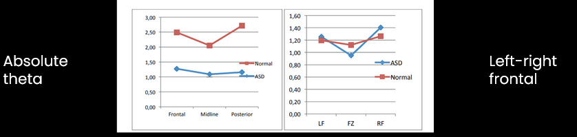
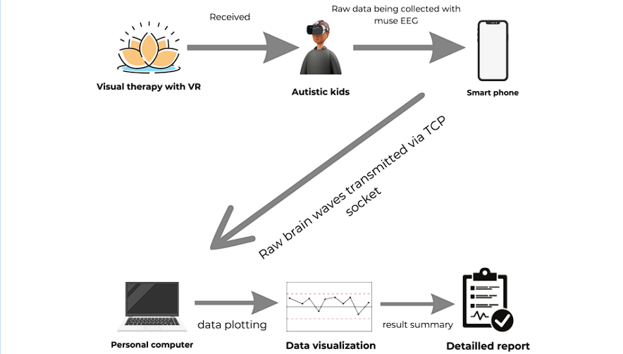

# VISUAL THERAPY TO AUTISTIC KIDS USING VR | Unity, Python, HTC Vive |                                            Nov 2023

- The integration of neurofeedback and relaxing therapy  techniques into Virtual Reality (VR) devices has scope for enhancing mental well-being of people with Autism Spectrum Disorder(ASD).
- The challenge lies in developing an efficient application that includes neurofeedback principles and relaxing therapy for autistic people within the context of VR.
- This requires addressing issues such as real-time data analysis, and seamless user interaction to create engaging VR application for neurofeedback-based therapy.

## SOLUTION ANALYSIS 
Here is a quick comparison between EEG data that we have collected.
The distribution of theta waves between the ASD and normal group with higher intensity and the synchronization of theta waves between the frontal and posterior regions between the normal group. 

## WORKFLOW

## take a look at the project 
[Download the MP3 file](https://github.com/dhivakar020/Visual-therapy-to-autistic-kids-using-VR/blob/main/Team%20Zion_OR.mp4)
